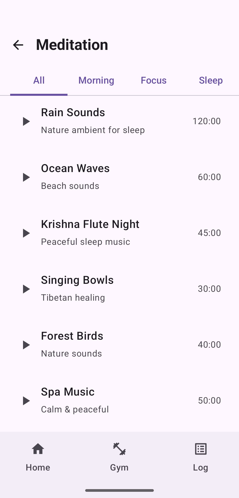

# GymApp — Complete Fitness Companion

A modern Android fitness application built with **Jetpack Compose**, featuring workout tracking, exercise animations, meditation audio player, and more.

##  Screenshots

| Home | Workout | Meditation |
|------|---------|------------|
|  |  |  |

##  Features

###  Workout Tracker
- 129+ exercises with animated GIF demonstrations
- Categorized by muscle group (Chest, Back, Legs, Arms, Shoulders, ABS)
- Custom workout logging with sets, reps, and weight
- Exercise history and progress tracking

###  Meditation & Audio Player
- Background audio playback (works with screen off)
- Foreground Service with notification controls (Play/Pause/Stop)
- Categorized tracks: Morning, Focus, Sleep, Relaxation
- Streaming from cloud-hosted MP3 files
- Buffering indicator and playback progress

###  Additional Features
- Yoga & Stretching routines
- Power training programs
- Clean Material 3 UI with dark mode support
- Smooth navigation with Jetpack Navigation

##  Tech Stack

| Technology | Usage |
|-----------|-------|
| **Kotlin** | Primary language |
| **Jetpack Compose** | Modern declarative UI |
| **Material 3** | Design system |
| **ExoPlayer (Media3)** | Audio streaming & playback |
| **Foreground Service** | Background audio with notification |
| **Room Database** | Local data persistence |
| **Coil** | Image/GIF loading & caching |
| **Jetpack Navigation** | Screen navigation |
| **Coroutines** | Async operations |

##  Architecture
app/

├── data/

│   ├── database/          # Room DB, DAOs, Entities

│   └── repository/        # Data repositories

├── service/

│   └── MeditationAudioService.kt  # Foreground audio service

├── ui/

│   ├── home/              # Home screen

│   ├── workout/           # Exercise list & logging

│   ├── meditation/        # Audio player & track list

│   ├── yoga/              # Yoga routines

│   └── theme/             # Material 3 theming

└── navigation/            # Nav graph & routes


##  Getting Started

### Prerequisites
- Android Studio Hedgehog or later
- Kotlin 2.0+
- Min SDK: 26 (Android 8.0)
- Target SDK: 35

### Installation

1. Clone the repository:
   ```bash
   git clone https://github.com/prbrtr/GymApp.git

Open in Android Studio

Sync Gradle and run on device/emulator

Permissions Required
<uses-permission android:name="android.permission.INTERNET" />
<uses-permission android:name="android.permission.FOREGROUND_SERVICE" />
<uses-permission android:name="android.permission.FOREGROUND_SERVICE_MEDIA_PLAYBACK" />
<uses-permission android:name="android.permission.POST_NOTIFICATIONS" />

## Key Implementation Highlights
Background Audio with Foreground Service
Implements MediaPlayback foreground service type

Notification with Play/Pause/Stop controls

Audio continues when screen is off or app is in background

Proper lifecycle management (auto-stop on completion)

Exercise GIF Prefetching
Preloads 129 exercise GIFs on app start

Cached locally using Coil for instant display

Background coroutine loading with progress tracking

Room Database with Pre-populated Data
Exercises seeded on first launch

Workout logs with timestamps

Efficient queries with Flow/LiveData

##  Audio Assets
Meditation audio files are hosted separately and streamed at runtime.

##  License
This project is for educational and portfolio purposes.

##  Author

Priyabrata Ray

Software Engineer

LinkedIn
https://www.linkedin.com/in/priyabrata1998/

⭐ If you found this useful, please star the repository!
