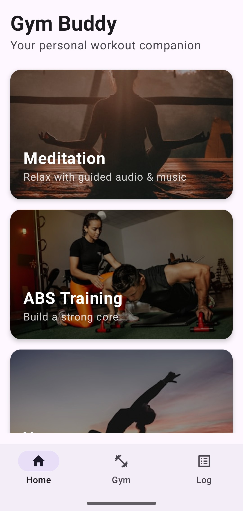
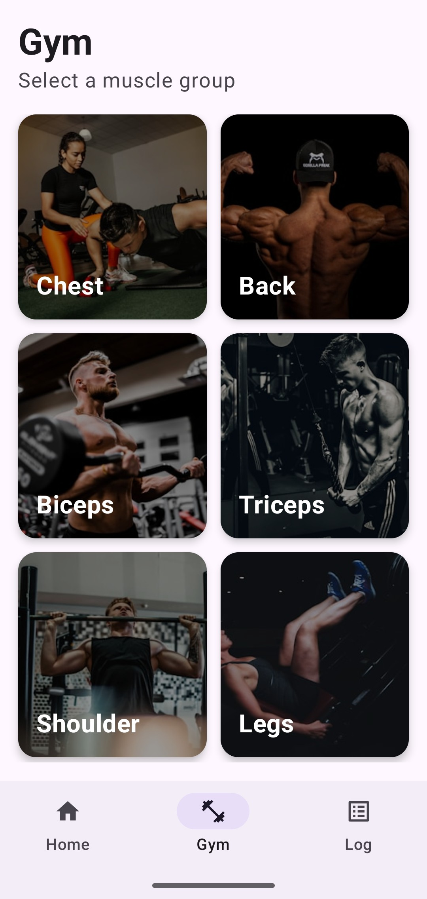

# GymApp — Complete Fitness Companion

A modern Android fitness application built with **Jetpack Compose**, featuring workout tracking, exercise animations, meditation audio player, and more.

## Screenshots

| Home | Workout | Meditation |
| :---: | :---: | :---: |
|  |  |  |

## Features

### Workout Tracker
- 129+ exercises with animated GIF demonstrations
- Categorized by muscle group (Chest, Back, Legs, Arms, Shoulders, ABS)
- Custom workout logging with sets, reps, and weight
- Exercise history and progress tracking

### Meditation & Audio Player
- Background audio playback (works with screen off)
- Foreground Service with notification controls (Play/Pause/Stop)
- Categorized tracks: Morning, Focus, Sleep, Relaxation
- Streaming from cloud-hosted MP3 files
- Buffering indicator and playback progress

### Additional Features
- Yoga & Stretching routines
- Power training programs
- Clean Material 3 UI with dark mode support
- Smooth navigation with Jetpack Navigation

## Tech Stack

| Technology | Usage |
| :--- | :--- |
| **Kotlin** | Primary language |
| **Jetpack Compose** | Modern declarative UI |
| **Material 3** | Design system |
| **ExoPlayer (Media3)** | Audio streaming & playback |
| **Foreground Service** | Background audio with notification |
| **Room Database** | Local data persistence |
| **Coil** | Image/GIF loading & caching |
| **Jetpack Navigation** | Screen navigation |
| **Coroutines** | Async operations |

## Getting Started

### Prerequisites
- Android Studio Hedgehog or later
- Kotlin 2.0+
- Min SDK: 26 (Android 8.0)
- Target SDK: 35

### Installation
1. Clone the repository:
   ```bash
   git clone [https://github.com/monadeep-1702/GYM-APP.git](https://github.com/monadeep-1702/GYM-APP.git)
